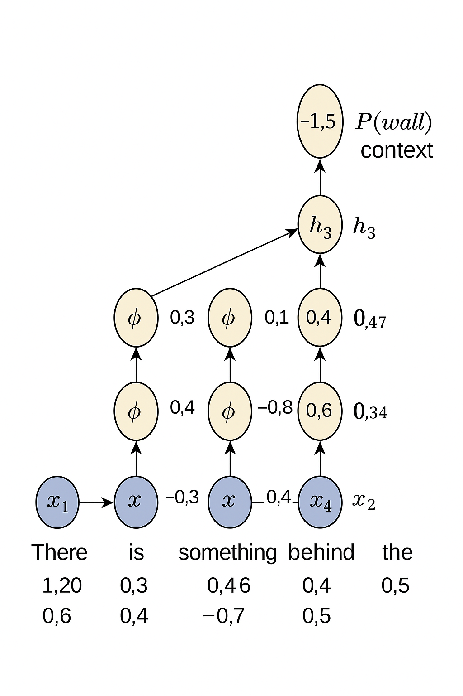
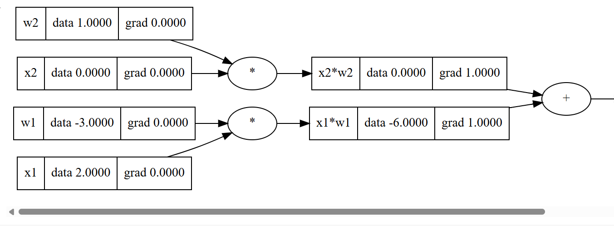

# Brain-from-Scratch

Build Neural Networks from Scratch using Mathematical Operators—no external libraries. This project implements neural networks based purely on backpropagation algorithms and manual mathematical operations.

## Overview

This repository demonstrates how neural networks work at a fundamental level by building them from scratch. It focuses on the backpropagation algorithm, allowing you to understand and visualize each step in the learning process.

- **Language:** Python (100%)
- **No external libraries**: All operations are manually implemented.
- **Educational**: Great for learning how neural networks actually function under the hood.

## Key Features

- Manual implementation of neural network layers and backpropagation.
- Visualization of data flow and gradients.
- Step-by-step mathematical operations for neural network training.

## Visual Example

Below is a visualization of a simple neural network computation, including forward and backward passes with gradients:



## Getting Started

1. **Clone the repository**:
    ```bash
    git clone https://github.com/fahdev789/Brain-from-Scratch.git
    cd Brain-from-Scratch
    ```

2. **Run the main Python file**:
    ```bash
    python main.py
    ```

3. **Explore and modify**:
    - Review the code and adjust parameters to see how learning changes.
    - All neural network operations are implemented manually for educational purposes.

## Repository Structure

- `main.py`: Entry point demonstrating core neural network logic.

## Contributing

Pull requests and suggestions are welcome! Please open an issue to discuss your ideas.

## License

This project is licensed under the MIT License.
